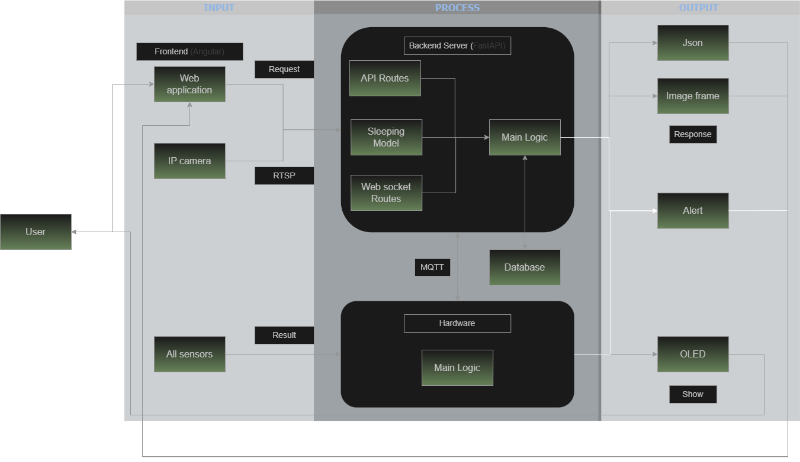
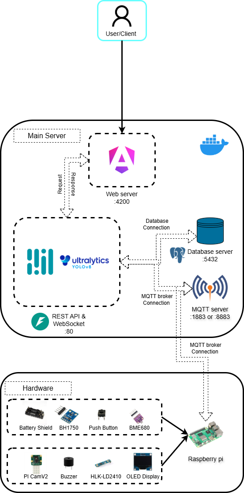
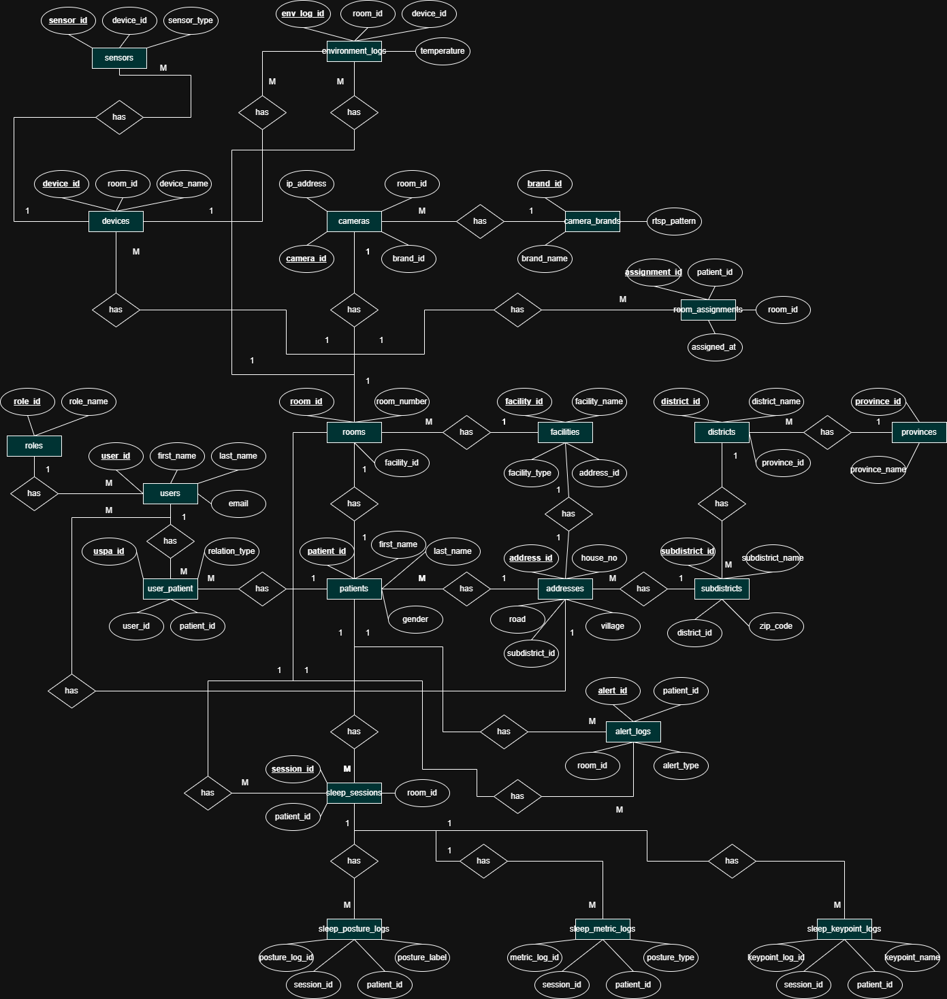
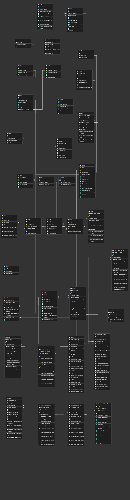

# AI Sleep Posture Monitoring System

> Graduation Project - Real-time AI system for monitoring bedridden patients' sleeping posture using Computer Vision and FastAPI.

## Overview

This project is designed to monitor the sleeping posture of bedridden patients in real time.  
The system detects the presence of both a person and a bed before analyzing the sleeping posture, then provides real-time results through a WebSocket connection.

### Key Features

- Real-time patient monitoring
- AI-based sleeping posture detection
- RESTful API with FastAPI
- WebSocket for live updates
- PostgreSQL and Timescaledb database
- Docker Compose deployment

---

# Tech Stack

| Category | Technology |
|----------|------------|
| Backend | FastAPI |
| AI Model | YOLOv8, MediaPipe |
| Database | PostgreSQL, Timescaledb |
| ORM | SQLAlchemy |
| Communication | WebSocket, MQTT |
| Container | Docker Compose |

---

# System Flow

The following diagram shows how data flows through the entire system.



---

# System Architecture

Overall architecture of the project.



---

# Database Design

## Conceptual Database Design



---

## Physical Database Schema

Actual database tables used in the implementation.



---

# Processing Pipeline

```text
Camera (RTSP)
      │
      ▼
YOLOv8
(Person + Bed Detection)
      │
      ▼
Person & Bed Found?
      │
      ├── No → Wait
      │
      ▼ Yes
YOLOv8 Pose
      │
      ▼
MediaPipe Pose
      │
      ▼
Posture Analysis
      │
      ▼
FastAPI
      │
      ├── REST API
      ├── WebSocket
      ▼
Timescaledb Database
      │
      ▼
Frontend Dashboard
```

---

# Demo Video

Watch the presentation here:

https://www.youtube.com/watch?v=BZVUCJx2OuU&t=35s

---

# Author

**Romtham Burnrat**

Rajamangala University of Technology Srivijaya

Graduation Project (2025 - 2026)
